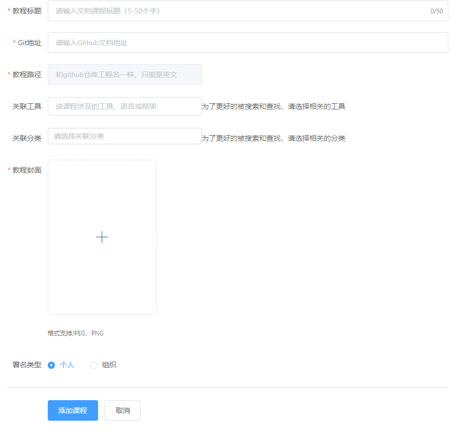
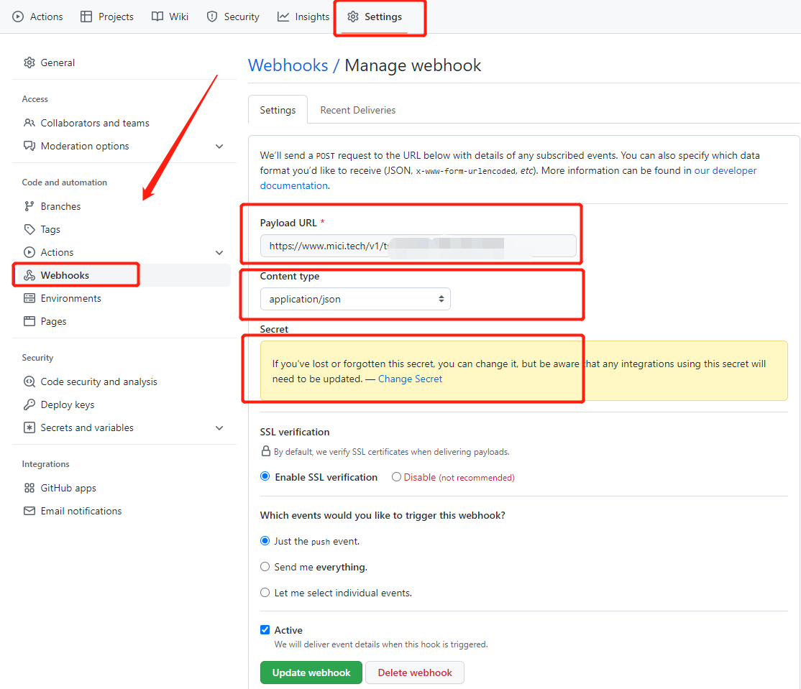

# 添加文档教程

幂次小栈的文档教程采用`mdBook`格式进行编写。  
所有文档均存放在`github`和`gitee`代码托管平台上。关于`mdBook`的使用可以参考[mdBook中文手册](https://doc.mici.tech/mdbook-chinese-tutorial/), 该中文手册由幂次小栈翻译。

## 创建文档教程的流程

### 在幂次小栈下创建Git仓库

在[GitHub幂次小栈组织](https://github.com/micitechstackoffical) 下创建代码库，由幂次小栈团队成员创建。
1. 跟`程序员小幂`沟通添加文档教程事宜，提供教程的名称、git仓库名称等，由`程序员小幂`在幂次小栈里创建`文档教程`。


2. 在Github幂次小栈组织下创建代码仓库，仓库类型为【公开】。 
 
3. 在代码仓库的设置里绑定webhook，


几个注意事项：
- Payload URL：填下幂次小栈提供的回调地址。
- Content type：选择 `application/json`。  
- Secret: 填下个人开发者秘钥  

基于webhook可以实现mdbook文档的自动构建、自动部署。  
4. 如果没有更新或者有其他问题，请联系客服咨询。

### 使用自己的Git仓库
1. 在幂次小栈个人中心——创作中心——创作教程中录入文本教程相关信息。


字段说明如下：
- 教程标题：教程名称，简短说明，比如：`C++入门教程`，`Java性能优化`。
- Git仓库地址：该教程在Github上代码仓库的克隆地址，教程都是以md格式编写，存放在Github上。
- 教程路径：该教程静态文件存放的目录，默认为仓库名称，目前根据Git仓库地址自动获取，不能修改，且有重复性校验。
- 关联工具：该教程是关于哪些工具的，便于搜索和查找。
- 关联分类：该教程是关于哪些分类的，便于搜索和查找。
- 教程封面：该教程的封面图，可以联系客服制作，自己制作宽:长=0.7为佳。
- 署名类型：分个人或组织两类。
   
添加完成保存后，可以在`教程`模块下显示，此时查看文档会不存在(因为仓库还未创建)。  
2. 在自己的空间下，创建上面的Git仓库地址。并添加webhook，注意几个点，其他默认即可。

- webhook地址：联系客服获取
- Content type设置为：application/json
- Secret：设置自己的开发秘钥
- 只监听push事件  

设置好后，就可以参考mdBook的文档进行编写了，当push到github时会自动触发编译和部署。如果有问题，请联系客服咨询。
## 问题 

### Github提交时网络无法连接
```
fatal: unable to access 'https://github.com/micitechstack/mici.git/': OpenSSL SSL_read: Connection was reset, errno 10054
```
解决办法1:
尝试取消git的代理
```shell
git config --global http.sslVerify "false"
git config --global --unset http.proxy
git config --global --unset https.proxy
```